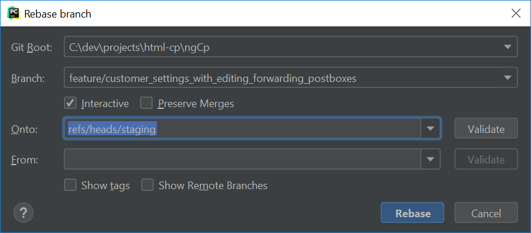

# git

## foo

- [change_commit_message](change_commit_message.md)
- [create_branch_with_current_changes](create_branch_with_current_changes.md)
- [delete_branch](delete_branch.md)
- [diff_and_difftool](diff_and_difftool.md)
- [generate_and_apply_patch_from_commit](generate_and_apply_patch_from_commit.md)
- [get_commit_message_list_of_new_changes](get_commit_message_list_of_new_changes.md)
- [handle_-different-_remote_origin](handle_-different-_remote_origin.md)
- [patch](patch.md)
- [pycharm_as_git_difftool_and_mergetool](pycharm_as_git_difftool_and_mergetool.md)
- [rebase_-and_squash_commits](rebase_-and_squash_commits.md)
- [remove_a_file_from_a_Git_repository_without_deleting_it_from_the_local_filesystem](remove_a_file_from_a_Git_repository_without_deleting_it_from_the_local_filesystem.md)
- [revert_last_local_commit](revert_last_local_commit.md)
- [tag](tag.md)

## Picures

### rebase pycharm

### show RCX differences (gitlab)

